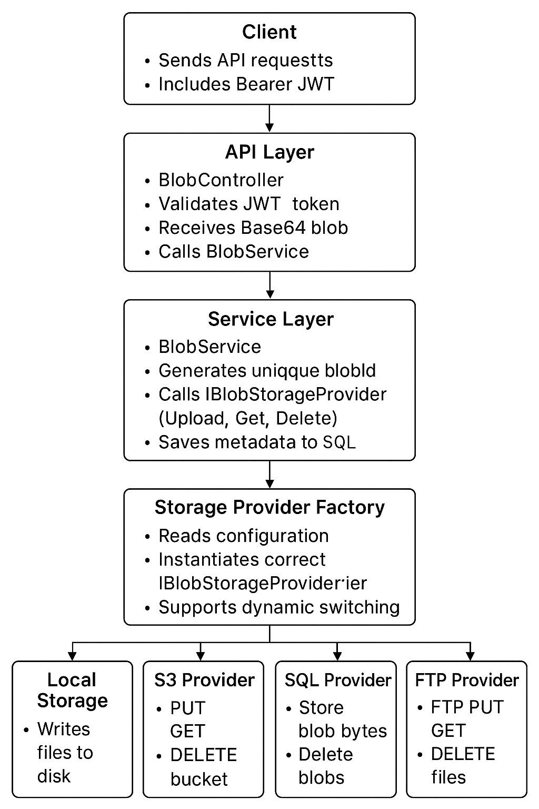
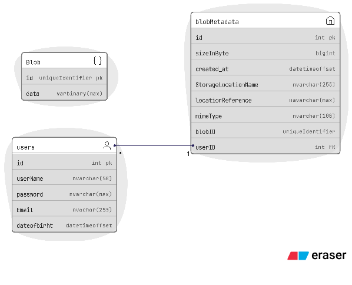

# MultiStoreSystem

This project implements a simple yet extensible Object Storage System that unifies multiple storage backends under a single, consistent interface.

It allows developers to interact with various storage services—such as cloud-based, database, or local file systems—without needing to change their application logic.

Supported Storage Backends
* Amazon S3–Compatible Storage Service

  - Implemented using MinIO for local S3 emulation.
  - Important: Interacts directly via HTTP requests only — no S3 SDKs or libraries are used.
  - Supports storing and retrieving files by manually implementing S3 protocol requests (PUT, GET, DELETE, etc.).

* Database Table: Store and retrieve binary data directly from a database as well as store Metadata , and User.
* Local File System: Save and access files on the host machine.
* FTP: For remote file storage via traditional file transfer protocol.


## Architecture Overview







## 🧩 Tech Stack

| Category            | Technologies Used |
|----------------------|-------------------|
| **Backend**          | C#, .NET Core, RESTful API(Swagger) |
| **Authentication**   | JWT (JSON Web Tokens) |
| **Database**         | SQL Server, Entity Framework Core |
| **Object Storage**   | MinIO (S3-compatible) via Docker |
| **File Transfer**    | FluentFTP + FileZilla (FTP Server) |
| **Testing**          | xUnit.net |


first set your configuration on BlobStorage.Api/appsettings.json 

```bash
{
  "Logging": {
    "LogLevel": {
      "Default": "Information",
      "Microsoft.AspNetCore": "Warning"
    }
  },
  "AllowedHosts": "*",
  "ConnectionStrings": {
    "DefaultConnection": ""
  },
  "Jwt": {
    "Key": "",
    "Issuer": "https://localhost:7042/api",// swagger address by default
    "Audience": "https://localhost:7042/api/Data/data",
    "AccessTokenExpirationMinutes": 15, // Ensure this is a positive integer
    "RefreshTokenExpirationDays": 7
  },
  "Storage": {
    "Provider": "Sql", // Options: "Sql", "LocalStorage", "S3", "FTP"
    "LocalStorage": {
      "BasePath": "D:\\BlobContainer"
    },
    "S3": {
      "endpoint": "", // MinIO endpoint 
      "Bucket": "",
      "AccessKey": "",
      "SecretKey": "",
      "Region": "us-east-1",
      "UsePathStyleEndpoint": true
    },
    "FTP": {
      "Host": "",
      "Port": 21,
      "Username": "",
      "Password": "",
      "BasePath": "/"
    },

    "Sql": {
      "SqlServer": "" // you set value of DefaultConnection here, using same databse
    }


  }
 }
```

- save changes
  
run 
```bash 
dotnet clean
```
 
run 
```bash 
dotnet build
```

then make sure you current database address by run : 
```bash
dotnet ef dbcontext info  --project BlobStorage.Providers.Sql --startup-project BlobStorage.Api
```


## 🗄️ Database Migration Commands

Use the following commands to create and apply migrations for the SQL Server database.

```bash
# Create the initial migration for the tables
dotnet ef migrations add NameYourMigrationHere --project BlobStorage.Providers.Sql --startup-project BlobStorage.Api --context AppDbContext

# Apply the migrations to create the database and tables
dotnet ef database update "migragionname" --project BlobStorage.Providers.Sql --startup-project BlobStorage.Api
```


## 🗄️ Run MinIO + (Docker)

```bash
docker run -p 9000:9000 -p 9001:9001 --name minio \
  -e "MINIO_ROOT_USER=setyouradminusername" \
  -e "MINIO_ROOT_PASSWORD=setyouradminpass" \
  -v /tmp/minio-data:/data \
  -d minio/minio server /data --console-address ":9001"
```


### Note: create bucket

- Configure your app to use MinIO. make your configuration based on yours OS. 

-  user policy must set to [readwrite]

```bash
"S3": {
  "Endpoint": "yourminioendpoint",    // MinIO endpoint (HTTP) for example :http://localhost:9000
  "Bucket": "setbucketname",
  "AccessKey": "setadminusername",
  "SecretKey": "setadminpass",
  "Region": "us-east-1",
  "UsePathStyleEndpoint": true
}
```
4. Make sure S3 signing + endpoint code compatible with MinIO.
 
For example : http://localhost:9000/{bucket}/{key}


## 🗄️ Configure App using FTP 
For FTP server administeration make sure your server listeners set to = Expilict FTP over TSL and insecure palin text 


Note: install FileZilla server !


* Do not forget to add [Bearer token] in authorization field!.   


